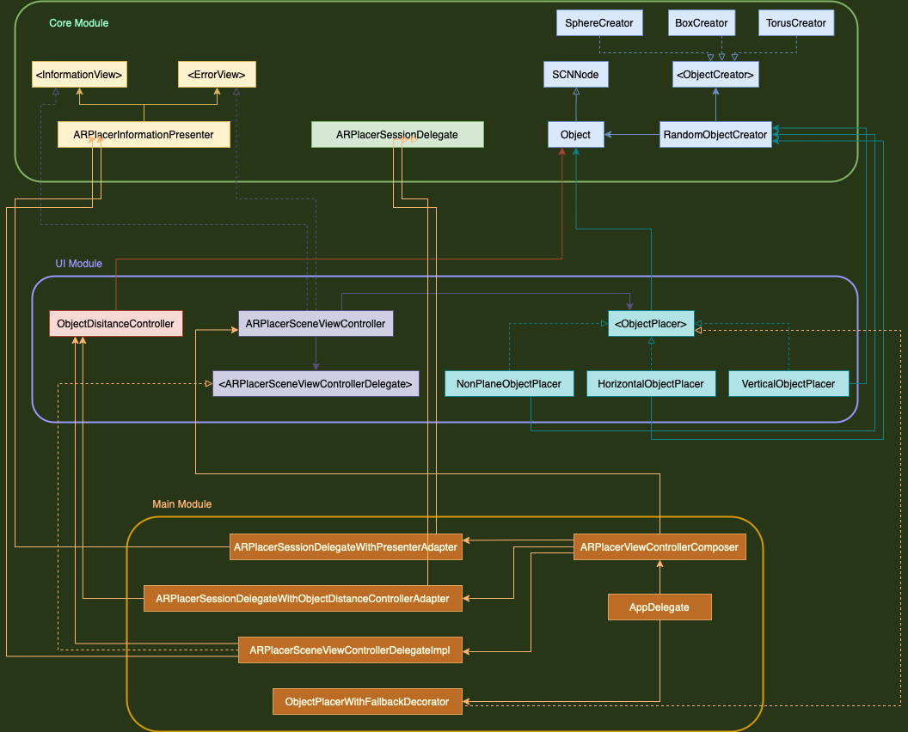

# ARPlacer
[](https://app.travis-ci.com/aloksbd/ARPlacer)

## BDD Spec
```
As a user I want to place a random object in real world.
I also want to see the distance between AR object and my phone.
```


## Use Cases
### 1. Scan the real world.
**Primary course:**
1. When the app opens, system should automatically start scanning the surrounding.
2. System should show user they can tap to place random object over the real world.

**Side Effect:**
1. System should continue scanning the area throughout the app’s life time.

**Camera tracking normal - Primary Course:**
1. System should show user they can tap to place random object over the real world.

**AR Session failed - Error Course:**
1. Show error
2. Give option to restart session

**Camera tracking limited - Error Course:**
1. Show error

**Camera tracking not available - Error Course:**
1. Show error

---

### 2. Place a random Object on real world
**Primary Course:**
1. User taps on screen over real world.
2. System creates an object of random shape and color.
3. System places this object in the tapped position over the real world.

**Anchor not available - Error Course:**
1. Show error

---

### 3. Display distance between object and phone
**Object is in the screen - Primary Course:**
1. System should calculate the distance between object and phone.
2. System displays the distance over the object in the screen.

**Object is not in the screen - Primary Course:**
1. System does nothing

---

## App Architecture


